# 嵌入式图网络
## 具体方向：边缘设备多模态大模型推理优化(基于Nvidia 设备)

## 一、阶段计划
### （一）调研并学习相关模型推理优化算法
这方面技术内容目前大模型相对于视觉模型做的比较好，可以先从大模型推理优化入手，图神经网络作为视觉模型在边缘设备推理优化的过程中有很多可以借鉴的地方。
### （二）推理优化算法实现
1. 计划现在先在3090（24G显存）上实现Llama3-8B等模型的设备离线推理部署，测试比较先进的一些模型量化以及推理优化方法（如：AWQ，SmoothQuant等），测试其推理准确率和加速比。
2. 在从Llama3-8B 模型过渡到常用的图神经网络模型（YOLO，ViT，Diffusion等模型），在3090上测试推理效果。

3. 过渡到在64G jetson-orin 上实现主流图网络算法，进行嵌入式离线推理部署，以及推理部署优化，优化方向有三个：

- 在维持模型架构的条件下，加快推理速度，做到较快推理出结果，减少推理时延。
- 考虑到嵌入式设备的显存大小有限，但是目前AI模型架构越来越大，部署时需要尽可能量化被部署模型的模型大小。
- 尽量减小模型量化后的精度损失。

这三者需要做到兼顾和平衡，才能呈现比较好的嵌入式系统AI推理。

## 二、模型量化技术原理

模型压缩主要分为如下几类：

- 剪枝（Pruning）
- 知识蒸馏（Knowledge Distillation）
- 量化

模型的量化技术主要分为两类：
1. 量化感知训练（QAT）
2. 训练后量化（PTQ）

模型量化面临着下面这些问题：

量化感知训练（QAT）由于训练成本较高并不实用，而训练后量化（PTQ）在低比特场景下面临较大的精度下降。

这里有一些基本的大模型量化技术原理的介绍：
[大模型量化技术原理](https://zhuanlan.zhihu.com/p/681578090)

什么是模型的context stage 和generate stage？如何理解？

答：类似于大模型当中的prefill阶段和decode阶段。prefill阶段用于处理一次性输入的prompts，计算出其KV矩阵，存储在KV缓存当中使用，这样方便后面的自适应循环生成新tokens（即decode阶段）使用，总的来说LLM推理过程分为两个阶段，PD（prefill和decode），并出现了一种较为有名的优化方法，就是**PD分离**。

对TFLOPS的认识：

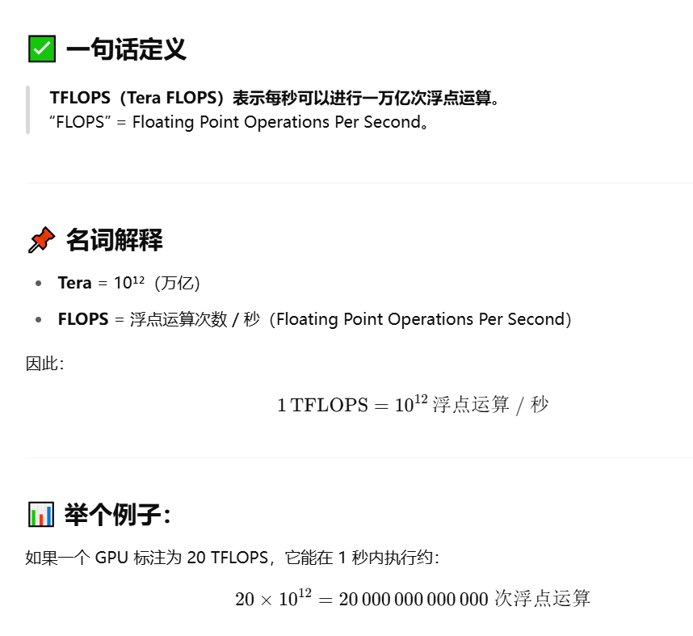

### 2.1 AWQ、AutoAWQ
**AWQ（AWQ: Activation-aware Weight Quantization for LLM Compression and Acceleration）是一种对大模型仅权重量化方法。通过保护更“重要”的权重不进行量化，从而在不进行训练的情况下提高准确率。**

原理是：权重对于LLM的性能并不同等重要”的观察，存在约（0.1%-1%）显著权重对大模型性能影响太大，通过跳过这1%的显著权重（salient weight）不进行量化，可以大大减少量化误差。但是这种方法由于是混合精度的，对硬件并不是很友好，这里AWQ技术主要是针对解决这个问题，所有权重都量化，但是是通过激活感知缩放保护显著权重。

**具体细节在上面文章链接当中查看**

**主要应用： 可利用AWQ方法在jetson orin上部署llma2-70B参数的模型**

论文名称：AWQ: ACTIVATION-AWARE WEIGHT QUANTIZATION FOR
ON-DEVICE LLM COMPRESSION AND ACCELERATION

作者：Mit 韩松团队

会议：MLSys 

时间：2024 Best Paper Award

AWQ对应在边缘设备上的应用是**TinyChat**：是一种尖端的聊天机器人界面，其设计可在 GPU 平台上实现轻量级资源消耗和快速推理。

LLaMA-3-8B 在 jetson-orin上获得了2.9倍的加速 (2.9x faster than FP16)，比纯FP16精度快2.9倍。性能提升对比如下：

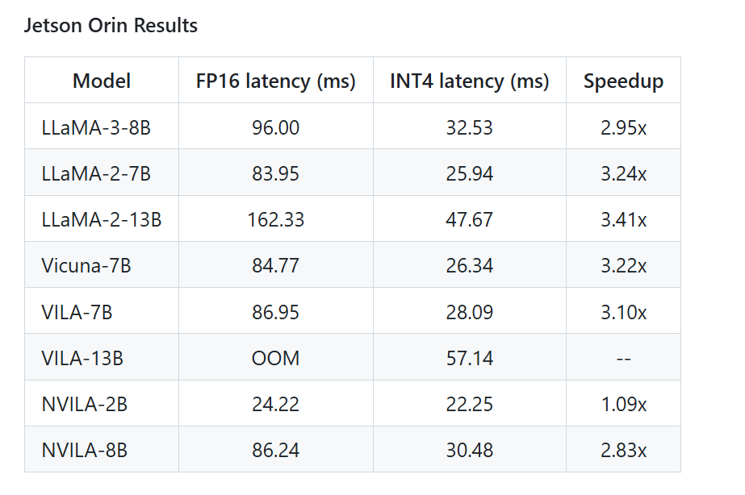

#### 2.1.1 基础知识
（GEMM）General Matrix-Matrix Multiplication
#### 2.1.2 技术内容
基于激活值来选择“重要的”权重通道比基于权重大小或者权重的L1、L2范式来选择“重要的”权重的效果要好得多

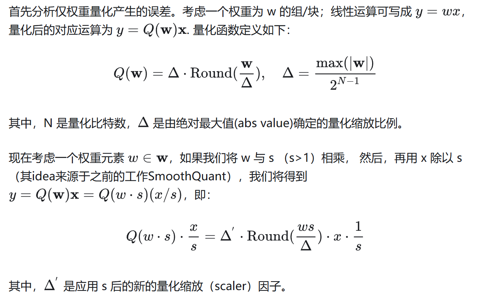
### 2.2 LLM.int8()
属于：RTN（round-to-nearest (RTN) 量化）

（论文：LLM.int8(): 8-bit Matrix Multiplication for Transformers at Scale）是一种采用混合精度分解的量化方法。该方案先做了一个矩阵分解，对绝大部分权重和激活用8bit量化（vector-wise）。对离群特征的几个维度保留16bit，对其做高精度的矩阵乘法。

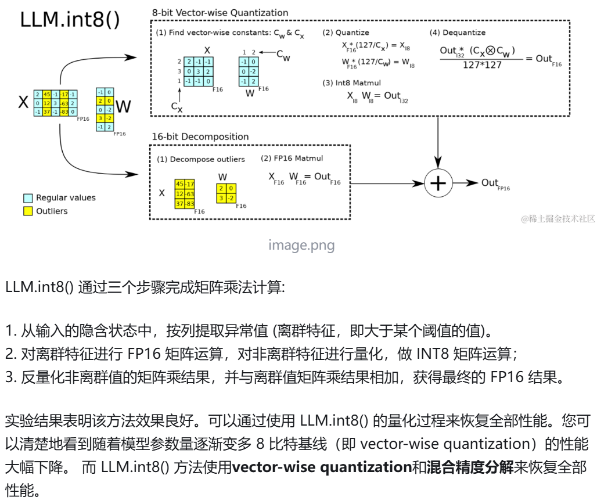

但是这种分离计算的方式拖慢了推理速度

int8量化是量化 任何模型最简单的方法之一，这里对于了离群值的处理回大大拖慢了推理速度，因为在计算过程中分成两部分计算，离群值部分用fp16来计算，被int8量化的非离群值用int8来计算。

### 2.3 GPTQ（2022）
GPTQ(论文：GPTQ: ACCURATE POST-TRAINING QUANTIZATION FOR GENERATIVE PR E-TRAINED TRANSFORMERS) 采用 int4/fp16 (W4A16) 的混合量化方案，其中模型权重被量化为 int4 数值类型，而激活值则保留在 float16，是一种仅权重量化方法。在推理阶段，模型权重被动态地反量化回 float16 并在该数值类型下进行实际的运算；同 OBQ 一样，GPTQ还是从单层量化的角度考虑，希望找到一个量化过的权重，使的新的权重和老的权重之间输出的结果差别最小。

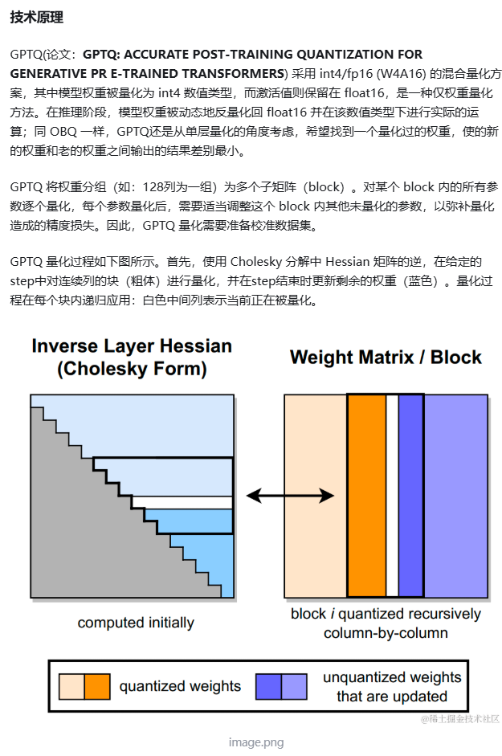

那GPTQ有什么优势呢？

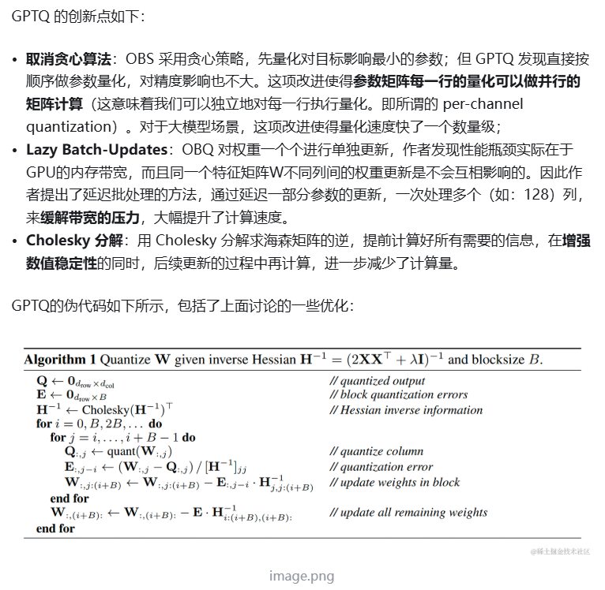

### 2.4 SmoothQuant

驱动安装
Nvidia 驱动
cuda 驱动

## 三、Ampere（A100） 架构学习（Orin 用的GPU同为Ampere架构）
每个A100 有108个SM（流式多处理器），每个SM有64个Cuda核心（int32，fp32），一个block最多对应对应1024个线程（这个是硬件当中预先定义好的，无法改变，所以cuda编程时，每个block的线程设置不能超过1024个），多个block对应我们A100架构的一个SM处理单元，block被分到某个SM上，则会保存到该SM上直到执行解说，同一时间段一个SM可以同时容纳多个block，每个SM中有1024个FMA独立计算单元，对应2048个独立的浮点运算，等效为2048个线程（这里不是SM的cuda core总数，而是最大活跃线程，即一个时钟周期可以执行2048个线程，block内线程的个数设置成1024，即最大活跃线程的一半），至于为什么是2048，因为一个SM有4个warp scheduler，最多能同时管理 64 个 warps（64*32=2048）A100总共108个SM，所以A100总共存在108*2048=221184个并发线程（最大活跃线程）。
所以cuda编程当中，一个block只能写1024个线程即：

dim3 blockdim(1024,1,1)或者
dim3 blockdim(32,32,1)....

反正最后相乘起来结果为1024.

至于grid：
硬件限制由 CUDA 运行时和 GPU 的硬件寄存器固定，具体为：

gridDim.x 最大值： 2³¹ - 1 = 2147483647

gridDim.y 最大值： 65535

gridDim.z 最大值： 65535

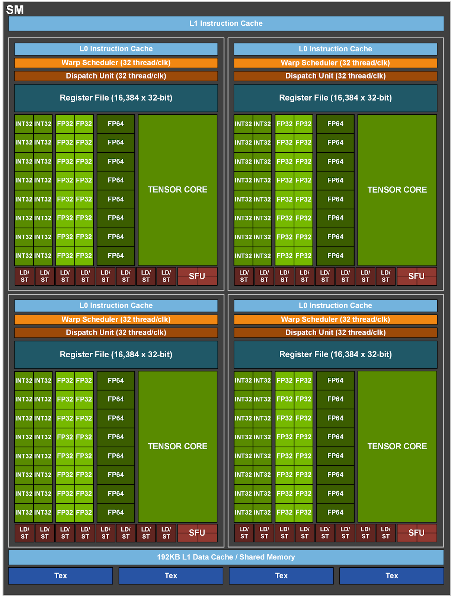

### 1. Orin GPU结构
Orin采用NVIDIA Ampere GPU，具有两个GPC（Graphics Processing Clusters）和128个CUDA Core。总计2048个CUDA Core和64个Tensor Core，INT8稀疏算力高达170 TOPS。Ampere GPU支持CUDA语言，提供高级并行处理计算能力，并在图形处理和深度学习方面表现卓越。

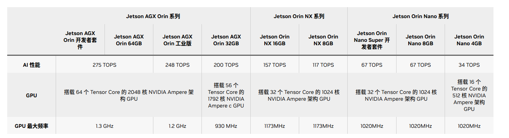

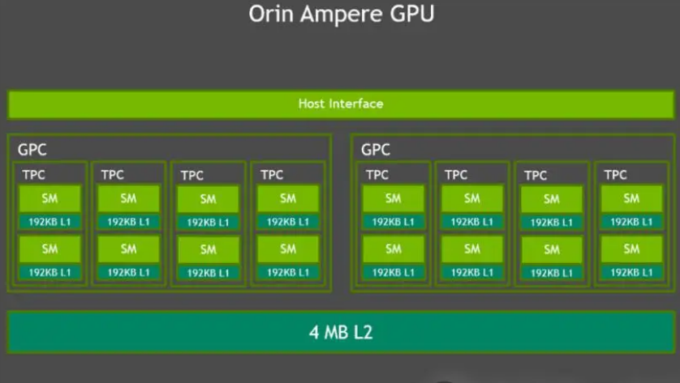

Cuda Core 和Tensor Core 的使用方式是不一样的，cuda core 是单元素计算，而tensor core是直接输入矩阵进行计算

使用的API 为WMMA API

除了WMMA API, 也可以通过使用 NVIDIA 库来来间接使用 Tensor Cores. 例如cuBLAS 和 cuDNN. cuBLAS 利用 Tensor Cores 加速密集矩阵乘法(GEMM)计算; cuDNN 则利用 Tensor Cores 加速卷积和循环神经网络(RNNs)的计算.

下面这篇博客详细讲解了Tensor Core的使用方法：

https://blog.csdn.net/CV_Autobot/article/details/138460383

## 四、图神经网络
神经网络划分为五大类别，分别是：图卷积网络（Graph Convolution Networks，GCN）、 图注意力网络（Graph Attention Networks）、图自编码器（ Graph Autoencoders）、图生成网络（ Graph Generative Networks） 和图时空网络（Graph Spatial-temporal Networks）

## Megartron 当中的TP并行

### 1. 首先是MLP，megatron给出的策略是先列切后行切，这样做的目的是可以局部做gelu激活。

MLP的结构主要是GEMM(A)+GELU+GEMM(B)。

运行到最后时，需要做AllReduce加和来完成MLP的计算。

A的权重列切，激活值计算的结果刚好是被列切的，可以和B的被行切的权重计算，然后AllReduce得到最终结果。

forward和backward都做一次AllReduce即可。
### 2. Attention的切法
由于attention注意力机制的多头似乎是给张量并行量身定做的， QKV按照head数切分到不同的GPU上（属于列切），在注意力机制后的线性层O权重做行切，最后All-Reduce相加即可。

同样的，前反向做一次AllReduce 共两次

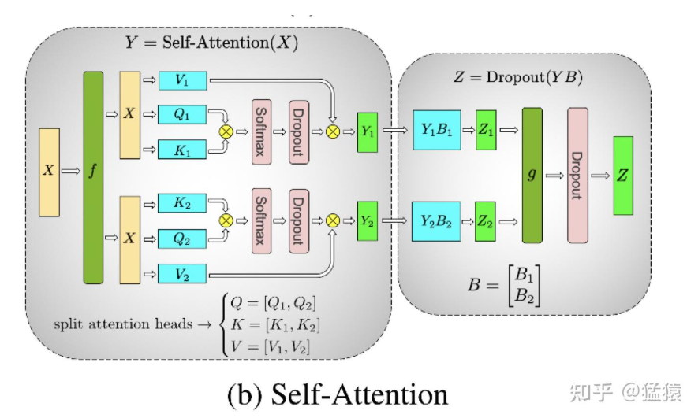

### 3. Embedding层
3.1 输入层的 embedding

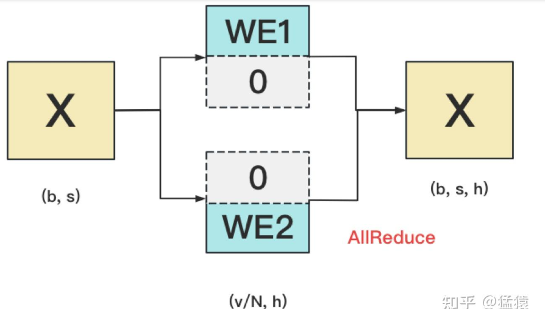

输入的[b,s]是每个token对应的embedding （h维）的查找。

将word embedding做行切，X分别去切过的WE上查找，查找到就返回对应的h，未查找到就返回0，最后做All-Reduce即可。

注！！！：这里的操作只是查找的操作，而并不是矩阵乘的操作，所以可以行切再All Reduce

3.2. 输出层的 embeding 

这里对转置后的WE矩阵做列切，可以做矩阵乘，得到最终的[b,s,v/N]结果，再做All-Gather得到[b,s,v]。

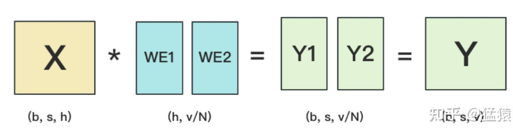

