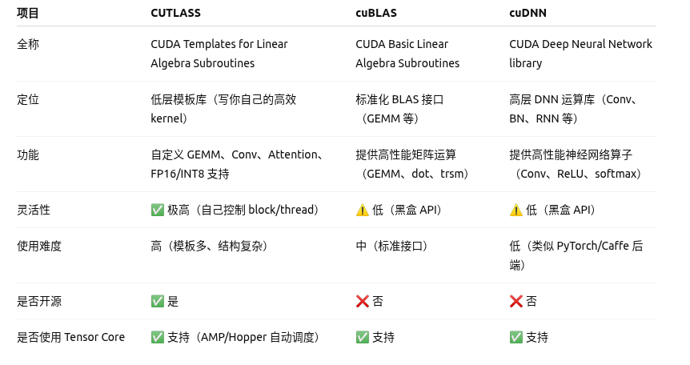

# Cuda 编程相关

- nvprof在Ampere系列GPU已经不再适用了，用nsys(Nsight Systems)
- \_\_shared\_\_ shared memery 的使用方法：
  1. 从软件概念来讲，一个共享内存是在一个block内，block内的所有线程都能使用该共享内存
  2. 从硬件概念来讲，一个共享内存是在一个sm中
  3. 在核函数当中声明的shared memery 在整个block当中可以共享，跟随整个block的生命周期
- 核函数是针对每个线程进行编程的
- 共享内存在每个线程块内内存共享，线程块之间不共享
- cutlass，cublas，cudnn的区别和联系

