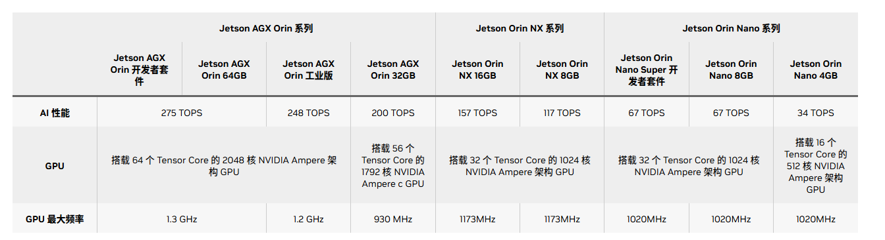

# 嵌入式图网络
## 具体方向：边缘设备多模态大模型推理优化(基于Nvidia 设备)

## 一、阶段计划
### （一）调研并学习相关模型推理优化算法
这方面技术内容目前大模型相对于视觉模型做的比较好，可以先从大模型推理优化入手，图神经网络作为视觉模型在边缘设备推理优化的过程中有很多可以借鉴的地方。
### （二）推理优化算法实现
1. 计划现在先在3090（24G显存）上实现Llama3-8B等模型的设备离线推理部署，测试比较先进的一些模型量化以及推理优化方法（如：AWQ，SmoothQuant等），测试其推理准确率和加速比。
2. 在从Llama3-8B 模型过渡到常用的图神经网络模型（YOLO，ViT，Diffusion等模型），在3090上测试推理效果。

3. 过渡到在64G jetson-orin 上实现主流图网络算法，进行嵌入式离线推理部署，以及推理部署优化，优化方向有三个：

- 在维持模型架构的条件下，加快推理速度，做到较快推理出结果，减少推理时延。
- 考虑到嵌入式设备的显存大小有限，但是目前AI模型架构越来越大，部署时需要尽可能量化被部署模型的模型大小。
- 尽量减小模型量化后的精度损失。

这三者需要做到兼顾和平衡，才能呈现比较好的嵌入式系统AI推理。

## 二、模型量化技术原理

模型压缩主要分为如下几类：

- 剪枝（Pruning）
- 知识蒸馏（Knowledge Distillation）
- 量化

模型的量化技术主要分为两类：
1. 量化感知训练（QAT）
2. 训练后量化（PTQ）

模型量化面临着下面这些问题：

量化感知训练（QAT）由于训练成本较高并不实用，而训练后量化（PTQ）在低比特场景下面临较大的精度下降。

---

_**在边缘设备部署过程中，主要考虑使用训练后量化（PTQ）的方法**_

在有限的计算资源上，进行低比特场景的量化，并尽量减少精度的下降。

## 三、主流的算法调研和实现
### 3.1 SmoothQuant（SmoothQuant: Accurate and Efficient Post-Training Quantization for Large Language Models）

论文名称：SmoothQuant: Accurate and Efficient Post-Training Quantization for Large Language Models

作者：Mit 韩松团队

会议：ICML

时间：2023

是一种同时确保准确率且推理高效的训练后量化 (PTQ) 方法，可实现 8 比特权重、8 比特激活 (W8A8) 量化。由于权重很容易量化，而激活则较难量化，因此，SmoothQuant 引入平滑因子s来平滑激活异常值，通过数学上等效的变换将量化难度从激活转移到权重上。

### 3.2 AWQ（AWQ: Activation-aware Weight Quantization for LLM Compression and Acceleration）

论文名称：AWQ: ACTIVATION-AWARE WEIGHT QUANTIZATION FOR
ON-DEVICE LLM COMPRESSION AND ACCELERATION

作者：Mit 韩松团队

会议：MLSys Best Paper Award

时间：2024 

---

**技术方法**：

基础的量化方法，低比特量化：

$$
Q(\mathbf{w})=\Delta \cdot \operatorname{Round}\left(\frac{\mathbf{w}}{\Delta}\right), \quad \Delta=\frac{\max (|\mathbf{w}|)}{2^{N-1}}
$$

加入scaler控制量化权重，借鉴了SmoothQuant 思想（SmoothQuant的scale针对同一个tensor适用，而AWQ的scaler针对每一个channel的重要性来看，所以AWQ量化过程更具体）：

$$
Q(w \cdot s) \cdot \frac{x}{s}=\Delta^{\prime} \cdot \operatorname{Round}\left(\frac{w s}{\Delta^{\prime}}\right) \cdot x \cdot \frac{1}{s}
$$
寻找最小s的方法：
$$
\begin{array}{c}
\mathbf{s}^{*}=\underset{\mathbf{s}}{\arg \min } \mathcal{L}(\mathbf{s}) \\
\\
\mathcal{L}(\mathbf{s})=\left\|Q(\mathbf{W} \cdot \operatorname{diag}(\mathbf{s}))\left(\operatorname{diag}(\mathbf{s})^{-\mathbf{1}} \cdot \mathbf{X}\right)-\mathbf{W X}\right\|
\end{array}
$$

---
**主要应用： 可利用AWQ方法在jetson orin上部署llma2-70B参数的模型**

AWQ对应在边缘设备上的应用是**TinyChat**：是一种尖端的聊天机器人界面，其设计可在 GPU 平台上实现轻量级资源消耗和快速推理。

LLaMA-3-8B 在 jetson-orin上获得了2.9倍的加速 (2.9x faster than FP16)，比纯FP16精度快2.9倍。性能提升对比如下：

## 四、Ampere（A100） 架构学习（Orin 用的GPU同为Ampere架构）
每个A100 有108个SM（流式多处理器），每个SM有64个Cuda核心（int32，fp32），一个block最多对应对应1024个线程（这个是硬件当中预先定义好的，无法改变，所以cuda编程时，每个block的线程设置不能超过1024个），多个block对应我们A100架构的一个SM处理单元，block被分到某个SM上，则会保存到该SM上直到执行解说，同一时间段一个SM可以同时容纳多个block，每个SM中有1024个FMA独立计算单元，对应2048个独立的浮点运算，等效为2048个线程（这里不是SM的cuda core总数，而是最大活跃线程，即一个时钟周期可以执行2048个线程，block内线程的个数设置成1024，即最大活跃线程的一半），至于为什么是2048，因为一个SM有4个warp scheduler，最多能同时管理 64 个 warps（64*32=2048）A100总共108个SM，所以A100总共存在108*2048=221184个并发线程（最大活跃线程）。

### 1. Orin GPU结构
Orin采用NVIDIA Ampere GPU，具有两个GPC（Graphics Processing Clusters）和128个CUDA Core。总计2048个CUDA Core和64个Tensor Core，INT8稀疏算力高达170 TOPS。Ampere GPU支持CUDA语言，提供高级并行处理计算能力，并在图形处理和深度学习方面表现卓越。

