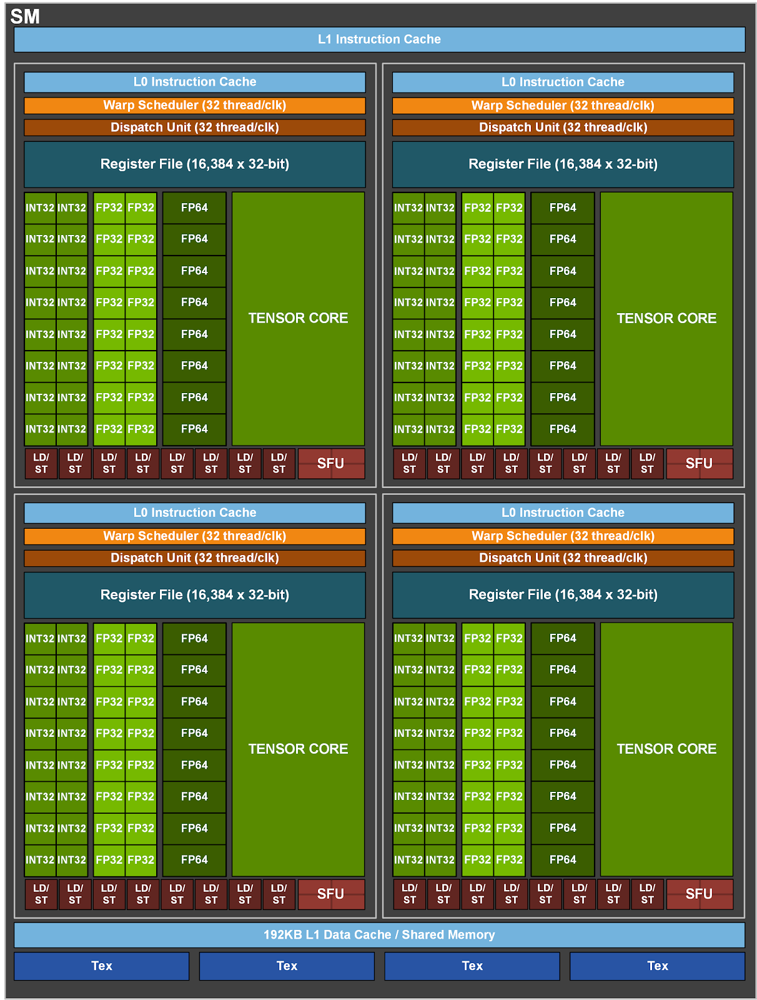

# 嵌入式图网络
## 具体方向：边缘设备多模态大模型推理优化(基于Nvidia 设备)


## 一、阶段计划
### （一）调研并学习相关模型推理优化算法
这方面技术内容目前大模型相对于视觉模型做的比较好，可以先从大模型推理优化入手，图神经网络作为视觉模型在边缘设备推理优化的过程中有很多可以借鉴的地方。
### （二）推理优化算法研究
1. 计划现在先在3090（24G显存）上实现Llama3-8B等模型的设备离线推理部署，测试比较先进的一些模型量化以及推理优化方法（如：AWQ，SmoothQuant等），测试其推理准确率和加速比。
2. 在从Llama3-8B 模型过渡到常用的图神经网络模型（YOLO，ViT，Diffusion等模型），在3090上测试推理效果。

3. 过渡到在64G jetson-orin 上实现主流图网络算法，多模态大模型算法，进行嵌入式离线推理部署，以及推理部署优化，优化方向有三个：

- 在维持模型架构的条件下，加快推理速度，做到较快推理出结果，减少推理时延。
- 考虑到嵌入式设备的显存大小有限，但是目前AI模型架构越来越大，部署时需要尽可能量化被部署模型的模型大小。
- 尽量减小模型量化后的精度损失。

这三者需要做到兼顾和平衡，才能呈现比较好的嵌入式系统AI推理。

## 二、模型量化技术原理

模型压缩主要分为如下几类：

- 剪枝（Pruning）
- 知识蒸馏（Knowledge Distillation）
- 量化

模型的量化技术主要分为两类：
1. 量化感知训练（QAT）
2. 训练后量化（PTQ）

模型量化面临着下面这些问题：

量化感知训练（QAT）由于训练成本较高并不实用，而训练后量化（PTQ）在低比特场景下面临较大的精度下降。

---

_**在边缘设备部署过程中，主要考虑使用训练后量化（PTQ）的方法**_

在有限的计算资源上，进行低比特场景的量化，并尽量减少精度的下降。

## 三、主流的算法调研和实现
### 3.1 SmoothQuant（SmoothQuant: Accurate and Efficient Post-Training Quantization for Large Language Models）

论文名称：SmoothQuant: Accurate and Efficient Post-Training Quantization for Large Language Models

作者：Mit 韩松团队

会议：ICML

时间：2023

是一种同时确保准确率且推理高效的训练后量化 (PTQ) 方法，可实现 8 比特权重、8 比特激活 (W8A8) 量化。由于权重很容易量化，而激活则较难量化，因此，SmoothQuant 引入平滑因子s来平滑激活异常值，通过数学上等效的变换将量化难度从激活转移到权重上。


### 3.2 AWQ（AWQ: Activation-aware Weight Quantization for LLM Compression and Acceleration）

论文名称：AWQ: ACTIVATION-AWARE WEIGHT QUANTIZATION FOR
ON-DEVICE LLM COMPRESSION AND ACCELERATION

作者：Mit 韩松团队

会议：MLSys Best Paper Award

时间：2024 

---

**技术方法**：


基础的量化方法，低比特量化：

$$
Q(\mathbf{w})=\Delta \cdot \operatorname{Round}\left(\frac{\mathbf{w}}{\Delta}\right), \quad \Delta=\frac{\max (|\mathbf{w}|)}{2^{N-1}}
$$

加入scaler控制量化权重，借鉴了SmoothQuant 思想（SmoothQuant的scale针对同一个tensor适用，而AWQ的scaler针对每一个channel的重要性来看，所以AWQ量化过程更具体）：

$$
Q(w \cdot s) \cdot \frac{x}{s}=\Delta^{\prime} \cdot \operatorname{Round}\left(\frac{w s}{\Delta^{\prime}}\right) \cdot x \cdot \frac{1}{s}
$$
寻找最小s的方法：
$$
\begin{array}{c}
\mathbf{s}^{*}=\underset{\mathbf{s}}{\arg \min } \mathcal{L}(\mathbf{s}) \\
\\
\mathcal{L}(\mathbf{s})=\left\|Q(\mathbf{W} \cdot \operatorname{diag}(\mathbf{s}))\left(\operatorname{diag}(\mathbf{s})^{-\mathbf{1}} \cdot \mathbf{X}\right)-\mathbf{W X}\right\|
\end{array}
$$

---
**主要应用： 可利用AWQ方法在jetson orin上部署llma2-70B参数的模型**

AWQ对应在边缘设备上的应用是**TinyChat**：是一种尖端的聊天机器人界面，其设计可在 GPU 平台上实现轻量级资源消耗和快速推理。

LLaMA-3-8B 在 jetson-orin上获得了2.9倍的加速 (2.9x faster than FP16)，比纯FP16精度快2.9倍。性能提升对比如下：


## 四、Ampere（A100） 架构学习（Orin 用的GPU同为Ampere架构）
每个A100 有108个SM（流式多处理器），每个SM有64个Cuda核心（int32，fp32），一个block最多对应对应1024个线程（这个是硬件当中预先定义好的，无法改变，所以cuda编程时，每个block的线程设置不能超过1024个），多个block对应我们A100架构的一个SM处理单元，block被分到某个SM上，则会保存到该SM上直到执行解说，同一时间段一个SM可以同时容纳多个block，每个SM中有1024个FMA独立计算单元，对应2048个独立的浮点运算，等效为2048个线程（这里不是SM的cuda core总数，而是最大活跃线程，即一个时钟周期可以执行2048个线程，block内线程的个数设置成1024，即最大活跃线程的一半），至于为什么是2048，因为一个SM有4个warp scheduler，最多能同时管理 64 个 warps（64\*32=2048,32个线程为一个warp）A100总共108个SM，所以A100总共存在108\*2048=221184个并发线程（最大活跃线程）。




### 1. Orin GPU结构
Orin采用NVIDIA Ampere GPU，具有两个GPC（Graphics Processing Clusters）和128个CUDA Core。总计2048个CUDA Core和64个Tensor Core，INT8稀疏算力高达170 TOPS。Ampere GPU支持CUDA语言，提供高级并行处理计算能力，并在图形处理和深度学习方面表现卓越。


16个SM，每个SM均为Ampere结构，与上面一样。

L1 cache：192KB

L2 cache：4MB

HBM：64G

可通过cuda编程进行算子优化或者算子融合来加速推理过程。

# 7月1日汇报

## 1. Orin DLA的使用

设备类型：Jetson Orin develop kit(64G)

包含的开发工具：


### 1.1 DLA（Deep Learning Accelerator）
DLA是Orin上面的深度学习加速器，是 Jetson Xavier 和 Orin 上的专用集成电路，能够运行常见的深度学习推理操作，例如卷积。这款专用硬件节能高效，可以让您从 GPU 上卸载工作，从而释放 GPU 来执行其他任务。

在Orin上共有两个DLA，使用DLA可以大大加快模型在Orin上面的推理速度。

目前DLA上面支持的算子有：
~~~
## 官网获取
Activation layer
Comparison operations (Equal, Greater, Less)
Concatenation layer
Convolution and Fully Connected layers
Deconvolution layer
ElementWise layer
LRN (Local Response Normalization) layer
Parametric ReLU layer
Pooling layer
Reduce layer
Resize layer
Scale layer
Shuffle layer
Slice layer
Softmax layer
Unary layer
~~~
算子类型有特定要求，例如下面conv和full-connect算子，仅支持两个空间维度，数据类型仅支持FP16和INT8等


使用**TensorRT**和**cuDLA**来调度DLA模块进而优化模型推理，在为 DLA 构建模型时，TensorRT 构建器会解析网络并调用 DLA 编译器将网络编译为 DLA 可加载文件。工作原理和使用方法如下：


测试网络如下：

```python
class ModelGN(nn.Module):
    def __init__(self, num_classes):
        super().__init__()
        self.cnn = nn.Sequential(
            nn.Conv2d(3, 64, kernel_size=3, stride=2, padding=1),
            nn.GroupNorm(8, 64),
            nn.ReLU(),
            nn.Conv2d(64, 128, kernel_size=3, stride=2, padding=1),
            nn.GroupNorm(8, 128),
            nn.ReLU(),
            nn.Conv2d(128, 256, kernel_size=3, stride=2, padding=1),
            nn.GroupNorm(8, 256),
            nn.ReLU(),
            nn.Conv2d(256, 512, kernel_size=3, stride=2, padding=1),
            nn.GroupNorm(8, 512),
            nn.ReLU()
        )
        self.pool = nn.AdaptiveAvgPool2d((1, 1))
        self.linear = nn.Linear(512, num_classes)

    def forward(self, x):
        x = self.cnn(x)
        x = self.pool(x)
        x = x.view(x.shape[0], -1)
        x = self.linear(x)
        return x

model_gn = ModelGN(num_classes=10).cuda().eval()
```
再用nvidia设备做推理时，需要将其转换成engine模型，这里主流的工作流程为：
~~~
PyTorch -> ONNX -> TensorRT
~~~
这里为了测试，我们直接利用虚拟权重，将其转换成onnx模型：
```python
data = torch.zeros(1, 3, 32, 32).cuda()
# 使用动态维度，方便engine模型使用其他任意维度
torch.onnx.export(model_gn, data, 'model_gn.onnx',
    input_names=['input'],
    output_names=['output'],
    dynamic_axes={
        'input': {0: 'batch_size'},
        'output': {0: 'batch_size'}
    }
)

```

上面步骤得到了onnx模型，利用下面TensorRT指令trtexec将其转换成engine模型
```
trtexec --onnx=model_gn.onnx --shapes=input:32x3x32x32 --saveEngine=model_gn.engine --exportProfile=model_gn.json --int8 --useDLACore=0 --allowGPUFallback --useSpinWait --separateProfileRun > model_gn.log
```

这里需要指定输入类型input，使用的DLA内核编号useDLACore(0或1),allowGPUFallback允许将DLA无法运行的Layer放回GPU上使用。


从打印信息可以发现，模型的有些层在DLA上运行而有些层在GPU上运行，使用nsys分析内核运行情况

```
nsys profile --trace=cuda,nvtx,cublas,cudla,cusparse,cudnn,nvmedia --output=model_gn.nvvp /usr/src/tensorrt/bin/trtexec --loadEngine=model_gn.engine --iterations=10 --idleTime=500 --duration=0 --useSpinWait
```

结果如下图：


DLA的调用被切成的多片，过程中浪费了很多IO的时间，中间变量的拷贝，影响了推理速度。分析发现DLA不支持GroupNorm算子的使用，在实际推理过程中，DLA会将变量拷贝到GPU上运行，运行结束之后，再拷贝回DLA，中间产生了大量的运行开销。

解决方案：我们这里把它换成BatchNorm算子


无法在DLA上运行的情况主要有三种：
1. 算子本身不支持DLA运行
2. 同一算子在onnx->engine转换时由于算子名称的差异而导致DLA无法识别导致的无法运行。
3. 算子本身支持，但无法满足DLA上指定算子的输入输出格式要求。


```
nn.GroupNorm(8, 64)-->nn.BatchNorm2d(64)
！主要问题：修改了模型结构，可能会影响精度。
```

修改之后以同样的方式测试上面修改后的模型，结果如下：


修改之后除了最后一层的池化层，整个序列的结构全在DLA上运行

| 推理设备  | GPU（3090） | Orin | Orin+DLA优化  |
|--------|------|------|------|
|  bps  | 258.577   | 305.926   | 649.723   |
|速率提升| 0 | 17.79% | 150.91% |

**注：bps表示每秒运行的batch数，越高越好**

